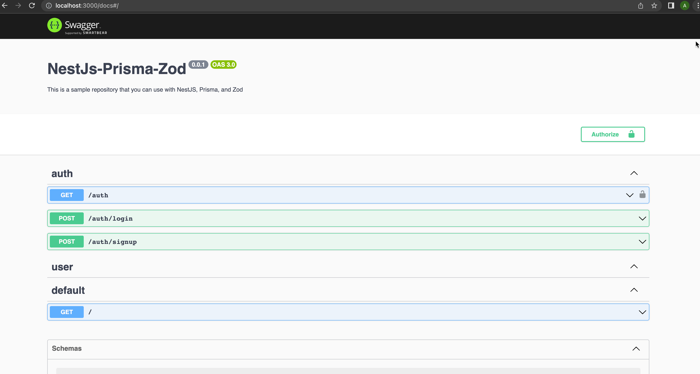

*Example README.md for a Git Repository*


# NestJS Prisma Boilerplate with JWT Authentication

<p align="center">
  
  
  
</p>

This is a boilerplate project that combines NestJS, Prisma, and Zod to provide a simple and secure authentication setup using JWT (Bearer Token). It also includes a MySQL database configuration to store user information.

## Getting Started

### Prerequisites

- Node.js (v14 or above)
- npm (v6 or above)
- MySQL database

### Installation

1. Clone the repository:

```bash
$ git clone https://github.com/AndriiKovpak/nestjs-prisma-zod
$ cd nestjs-prisma-boilerplate
```

2. Install dependencies:

```bash
$ npm install
```

3. Set up environment variables:

Create a `.env` file in the root directory of the project and provide the following information:

```dotenv
NODE_ENV=local

# Information
APP_TITLE=NestJs-Prisma-Zod
APP_DESCRIPTION=This is a sample repository that you can use with NestJS, Prisma, and Zod
VER=0.0.1

# Secret
SECRET={your-jwt-secret-key}
ROUNDS_OF_HASHING={your-bcrypt-rounds-of-hashing}
TOKEN_KEY=access-token

# Environment
ENV=local
API_HOST=http://localhost
API_PORT=3000
API_URL=http://localhost:3000

# Database
DATABASE_URL=mysql://{your-mysql-username}:{your-mysql-password}@{your-mysql-host}:3306/{your-database-name}
DATABASE_HOST={your-mysql-host}
DATABASE_USER={your-mysql-username}
DATABASE_PASSWORD={your-mysql-password}
DATABASE_DB={your-database-name}
```


Replace `your-mysql-username`, `your-mysql-password`, `your-mysql-host`, `your-database-name`, and `your-jwt-secret-key` with your actual values.

4. Generate Prisma client and database migrations:

```bash
$ npm run db:generate
$ npm run db:migrate:dev
```

5. DB seed

```bash
$ npm run db:seed
```

6. Start the application:

```bash
$ npm run dev
```

The NestJS server will now be running at `http://localhost:3000`.

The Swagger document will now be running at `http://localhost:3000/docs`.



## Authentication

This boilerplate includes JWT (Bearer Token) authentication. When making requests to protected routes, include the `Authorization` header with the value `Bearer <token>` where `<token>` is the access token obtained after successful login.

## API Endpoints

- **POST /auth/signup**: Register a new user.
- **POST /auth/login**: Login and obtain an access token.
- **GET /auth**: Get the currently logged-in user's profile.

## Built With

- NestJS - A progressive Node.js framework for building efficient and scalable server-side applications.
- Prisma - A modern database toolkit for TypeScript and Node.js.
- Zod - A TypeScript-first schema validation library.

## Contributing

Contributions are welcome! If you find any bugs or want to add new features, feel free to open an issue or submit a pull request.

## License

This project is licensed under the MIT License - see the [LICENSE](LICENSE) file for details.


Note: This README.md is a basic example and may require further customization based on the specific needs and features of your NestJS project with Prisma and JWT authentication. Always ensure to provide accurate instructions and information relevant to your repository.